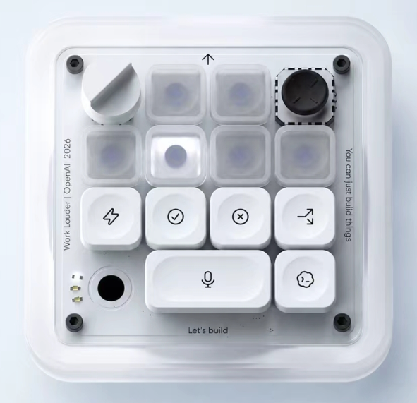

# CodeXMicro++



一款为 Codex 桌面端设计的源码可用 macOS 悬浮控制面板。

CodeXMicro++ 把任务切换、Plan / Goal 模式、推理强度、Agent 状态、Token 用量和常用工作流放到一块始终置顶的 4 × 4「微型键盘」里。应用完全在本机运行，不上传任务、按键或 Token 数据。

> 非 OpenAI 或 Work Louder 官方产品。Codex、OpenAI 等名称及标识归各自权利人所有。

## 下载与安装

前往 [Releases](https://github.com/gumuup/CodeXMicro-Plus/releases/latest) 下载最新版：

- `CodeXMicro++-3.0.0-universal.dmg`：macOS 通用安装包，支持 Apple Silicon 与 Intel Mac。
- `.sha256`：对应文件的 SHA-256 校验值。

系统要求：

- macOS 14 或更高版本
- 已安装 Codex 桌面应用
- 控制 Codex 时需要授予 macOS「辅助功能」权限

安装步骤：

1. 打开 DMG，把 `CodeXMicro++.app` 拖入「应用程序」。
2. 当前安装包未经 Apple 公证。首次启动时，请在 Finder 中按住 Control 点击应用并选择「打开」。
3. 按提示前往「系统设置 → 隐私与安全性 → 辅助功能」，允许 CodeXMicro++。
4. 重新打开应用。它会显示在桌面悬浮层和菜单栏中。

为确保 Fast、Plan 和推理强度等快捷操作可用，请把 [`codex-keybindings.json`](codex-keybindings.json) 中的条目合并到 `~/.codex/keybindings.json`，并保留你原有的自定义快捷键。

辅助功能权限用于接管你主动映射的物理按键，并向本机 Codex 发送对应操作。键盘事件只在内存中与已配置键码和修饰键比较，未命中内容不记录、不上传。

## 3.0.0 功能更新

- **独立快速启动轮盘**：默认按 `⌃Z` 在光标旁呼出轮盘，按住后移向操作并松手执行；轻按会保持显示。它与 `⌥Space` 快速启动互不影响。
- **完整轮盘编辑器**：在“设置 → 轮盘”中添加、删除、拖动排序和预览操作；新应用默认提供 8 个空位供用户自行配置，支持 Codex 工具箱全部预设、快捷键、普通应用、系统应用、插件入口、网址、粘贴文本、文件夹与 macOS 快捷指令，并可为每项录制独立直达快捷键。
- **轮盘全局模式**：开启后所有前台应用统一使用“全局模式”轮盘及其单项快捷键；关闭后恢复 ChatGPT 与各应用专属预设的自动匹配。
- **开箱即用预设**：全新安装默认开启全局模式，预置 ChatGPT、微信、飞书、剪映、App Store、系统设置、Chrome 和终端；ChatGPT 专属预设提供打开 Codex、侧边栏、任务导航、搜索、终端与 Skills。
- **标准设置窗口**：从悬浮面板点击齿轮会真实激活并聚焦设置窗口；切换应用后遵循标准 macOS 窗口顺序，并提供关闭、最小化、缩放三色交通灯与正常窗口缩放。

## 2.7.0 功能更新

- **全局快速启动**：默认按 `⌥Space` 即可在任意应用中显示或隐藏悬浮面板；可在“设置 → 快速启动”中录制其他组合、恢复默认并重新检查状态。
- **系统冲突检测**：快速启动会检查 macOS 系统快捷键，并通过系统热键注册识别其他应用占用；冲突设置会保留并在界面中明确标红，不会假装已经生效。
- **悬浮位置快捷切换**：默认 `⌃P` 在置顶和沉底间切换，面板顶部的图钉按钮也可直接操作；沉底层级已调整，避免被桌面遮住。
- **面板布局优化**：左下圆形键改为工具箱入口，标注开关移到顶部；累计 Token 数字会随长度调整字号。
- **双重授权**：从 2.7.0 起采用 PolyForm Noncommercial 1.0.0 与单独商业许可，允许免费非商业使用，商业使用或商业目的修改需书面授权。

## 2.6.0 功能更新

- **右下角语音键修复**：面板语音键改为点击一次开始、再次点击结束；外接物理按键仍保持按住开始、松开结束。
- **跟随 Codex 当前配置**：Fast、Plan、推理强度和语音操作会读取 `~/.codex/keybindings.json`，Codex 快捷键调整后无需修改应用源码。
- **可靠的前台投递**：从悬浮面板操作时会先确认 Codex 已切到前台，再通过系统 HID 通道发送完整的按下/松开事件，避免事件误发到原前台应用。
- **真实任务切换**：摇杆左右会在 A1–A6 的真实任务 ID 中循环，并通过 Codex 任务链接打开上一项或下一项；四个方向也都支持直接点击。
- **统一底层监听**：单键和组合键均由 CGEventTap 处理，完整覆盖按下、自动重复和松开，并过滤应用自身合成的事件。
- **避免重复触发**：启动新实例时会退出相同 Bundle ID 的旧实例，防止多个全局监听器同时响应。

### 物理按键映射

- **任意物理键映射**：Home、字母、空格、Esc，以及左右 Shift / Control / Option / Command 等任意单键都可以直接映射，无需预先转换为快捷键组合。
- **一级完整接管**：命中后拦截按下、长按和抬起；修饰键被映射时会从后续键盘事件中移除其原生标记，避免动作触发后系统仍响应原按键。
- **组合键一级监听**：单独轻点修饰键会映射修饰键本身，按住修饰键再按其他键则录入组合映射；单键和组合键都由同一个底层监听器接管，不再因系统或其他应用已经注册快捷键而失效。
- **按住说话语义**：物理单键与组合快捷键都保留按下开始、松开结束，面板与外接按键同时操作不会互相提前结束。
- **统一配置页**：设置中新增「自定义按键」，集中查看映射权限、运行状态、录入方式以及全部 19 个动作的绑定。

## 2.0.1 修复

- **恢复 Codex 按键控制**：将合成快捷键直接发送到当前 Codex 进程，修复新版 Codex 中 FAST 等面板按键无响应的问题。
- **减少重复授权**：安装包继续使用稳定签名，避免每次构建因签名变化而重新申请辅助功能权限。

## 2.0.0 功能更新

- **19 个全局快捷键**：无需先切换到 CodeXMicro++，即可操作任务键、摇杆、推理旋钮和主要功能键。
- **面板内直接配置**：右键对应按键、摇杆或推理旋钮半区，即可录制、改绑或清除快捷键。
- **可靠的快捷键管理**：自动检测系统占用和重复组合，保留用户自定义配置，并支持超时、取消与清除。
- **悬浮位置持久化**：可以在设置中选择置顶或沉底，重启后仍保留。
- **面板恢复与拖动优化**：关闭悬浮面板后重新打开应用会恢复显示，面板四边均可拖动。
- **稳定的本地签名**：源码构建与未配置 Developer ID 的安装包复用固定签名，减少升级后重复授权辅助功能。

## 功能说明

### 左上角摇杆

| 操作 | 功能 |
| --- | --- |
| 点击左侧或向左推 | 切换到上一个任务 |
| 点击右侧或向右推 | 切换到下一个任务 |
| 点击上侧或向上推 | 开启或关闭 Plan 计划模式 |
| 点击下侧或向下推 | 进入 Goal 目标模式，在输入框预填 `/goal `，等待输入目标后发送 |

### 右上角推理旋钮

- 点击左半边：降低推理强度。
- 点击右半边：增加推理强度。
- 也支持上下拖动或双指滚动。
- 强度分为轻度、中、高、极高四档，并带有刻度反馈。

### Agent 状态键

中间 6 个透明键显示最近的 6 个 Codex 任务：

- 蓝色：正在运行
- 黄色：等待输入
- 绿色：已完成
- 红色：出现异常
- 灰色：空闲

点击任意状态键会直接打开对应的 Codex 任务。

### CodeX 键

- Codex 未运行时：点击启动并跳转到 Codex。
- Codex 运行后：后台约每 20 秒刷新本周剩余 Token 比例与累计 Token 消耗。
- 单击按键：在「本周剩余」和「累计消耗」之间切换。
- 周剩余额度会以绿色、橙色、红色圆环提示余量。

### 自定义按键映射

- 右键面板上的任意功能键，或打开「设置 → 自定义按键」，可以录制、改绑或清除对应的按键映射。
- 推理旋钮左右半区和四向摇杆可分别配置按键映射。
- 面板支持 A1–A6、FAST、同意、拒绝、新任务、语音、标注切换和 Codex 状态等 19 个动作；另有快速启动、轮盘和悬浮位置切换，共 22 个可配置功能。
- 面板语音键点击一次开始听写，再次点击结束；物理快捷键仍是按住开始、松开结束。
- 键盘上的任意单键都可以直接映射，包括 Home、字母、空格、Esc，以及左 / 右 Shift、Control、Option、Command 等修饰键。一级映射会完整拦截该物理键，并覆盖所有使用该键的组合，不再把原本输入或修饰功能传给前台应用。
- 单独轻点并松开修饰键会映射修饰键本身；按住修饰键再按其他键则录入组合按键映射。组合键与单键走同一个一级事件监听，不申请 Carbon 独占热键；命中后会拦截按下、重复和松开，因此不会再显示“已被独占，当前未生效”。
- 同应用内重复按键会自动改绑到新功能。录制可通过界面的“取消”按钮退出，绑定可通过对应行的清除按钮移除；Esc 和 Delete 本身也可以被映射。配置只保存在本机。

#### 默认快捷键映射

以下是首次安装时的默认映射。表中的快捷键属于 CodeXMicro++ 全局快捷键；[`codex-keybindings.json`](codex-keybindings.json) 则是发送给 Codex 桌面端的内部快捷键，两者用途不同。

| 面板功能键 | 默认快捷键 | 映射功能 |
| --- | --- | --- |
| 快速启动 | `⌥Space` | 在任意应用中显示或隐藏悬浮面板 |
| 轮盘 | `⌃Z` | 在光标旁呼出快速启动轮盘；按住选择并松手执行 |
| 切换悬浮位置 | `⌃P` | 在置顶与沉底模式之间切换 |
| A1 | `⌃1` | 打开最近任务 1 |
| A2 | `⌃2` | 打开最近任务 2 |
| A3 | `⌃3` | 打开最近任务 3 |
| A4 | `⌃4` | 打开最近任务 4 |
| A5 | `⌃5` | 打开最近任务 5 |
| A6 | `⌃6` | 打开最近任务 6 |
| 摇杆上 | `⌃W` | 开启或关闭 Plan 计划模式 |
| 摇杆右 | `⌃D` | 切换到下一个任务 |
| 摇杆下 | `⌃S` | 进入 Goal 目标模式 |
| 摇杆左 | `⌃A` | 切换到上一个任务 |
| FAST | `⌃F` | 开启或关闭 Fast 模式 |
| 同意 | `⌃[` | 同意或确认当前请求 |
| 拒绝 | `⌃]` | 拒绝或取消当前请求 |
| 新任务 | `⌃N` | 创建新的 Codex 任务 |
| 显示 / 隐藏标注 | `⌃H` | 显示或隐藏面板按键标注 |
| 麦克风 | `⌃⇧D` | 按住开始、松开结束 Codex 语音听写 |
| CodeX 状态键 | `⌃C` | Codex 运行时切换周剩余/累计消耗；未运行时打开 Codex |
| 推理旋钮左半区 | `⌃-` | 降低一级推理强度 |
| 推理旋钮右半区 | `⌃=` | 提高一级推理强度 |

`⌃` 表示 Control，`⌥` 表示 Option，`⇧` 表示 Shift。19 个面板功能可以右键对应控件设置；快速启动、轮盘与悬浮位置切换可在设置页单独配置。

### 快速启动轮盘

- `⌥Space` 仍只负责显示或隐藏原悬浮面板；轮盘是位于其右侧的独立设置与独立热键。
- 侧边栏可开启“全局模式”；开启后所有应用统一使用全局轮盘，关闭后继续按前台应用自动匹配专属预设。
- 按住 `⌃Z`，把鼠标移向目标扇区后松开即可执行；快速轻按会让轮盘保持显示，随后可以点击选择，再按一次 `⌃Z` 可关闭。
- 轮盘跟随当前光标并自动限制在可用屏幕范围内，也可以通过菜单栏或设置页“预览”按钮打开。
- 每个轮盘支持 1–12 项操作，建议保留 6–10 项以形成稳定的方向记忆；操作顺序即顺时针排列顺序。
- 每个应用预设都可为轮盘项录制独立直达快捷键；同一组合键可在不同应用预设中复用，并按当前前台应用自动选择对应操作。未配置应用使用 ChatGPT 默认预设。
- 可配置类型包括 Codex 工具箱、任意组合键、应用程序、系统应用、插件入口、网址、粘贴文本、文件夹和 macOS 快捷指令；系统应用列表会自动读取系统设置、App Store、活动监视器等当前 Mac 已安装项目。
- 图标选择器可搜索全部 Codex 工具箱图标及百余个常用 macOS SF Symbols。

### 工具箱

按左下角圆形工具箱键，可以搜索并执行完整的 Codex 快捷操作，按「常用、任务、代码、Git、工具、导航、界面」分类，包括：

- Fast、同意、拒绝、发送、新任务、分叉、Plan、语音听写
- 任务搜索、任务内查找、归档、置顶、复制 Markdown
- Review、Terminal、调试、测试、重构、理解代码库、界面打磨
- Git 状态、提交、分支、合并、创建 / 审查 Pull Request、验证并推送
- 浏览器、文件、图片、OpenAI 文档、Skills、定时任务、插件
- 命令菜单、前进后退、侧边栏、底部面板、字体与推理强度

其中「一键工作流」会在新任务中填入经过整理的中文提示词并执行。

### 其他按键与交互

- `FAST`：切换 Fast 模式。
- `同意 / 拒绝`：响应 Codex 的确认请求。
- `新任务`：创建 Codex 任务。
- 麦克风：面板点击一次开始听写，再次点击结束；物理映射保持按住开始、松开结束。
- 左下圆形键：打开 Codex 工具箱；顶部眼睛按钮显示或隐藏按键文字。
- 设置：调整 Force Touch 触觉强度与机械按键音，管理自定义按键并检查物理映射状态。
- 拖动面板顶部或底部可移动；拖动四角可等比例缩放（300–700 px）。
- 菜单栏可显示、隐藏或退出悬浮面板，也可打开快速启动轮盘；悬浮面板默认 `⌥Space`，轮盘默认 `⌃Z`，原 `⌥⌘M` 切换方式继续保留。

## 隐私与安全

CodeXMicro++：

- 从 `~/.codex/state*.sqlite` 和本地 rollout 文件读取最近任务状态。
- 通过本机 Codex 命令读取 Token 用量，并限制为约 20 秒刷新一次。
- 不包含遥测、广告或第三方分析 SDK。
- 不上传任务内容、按键记录或账户用量。
- 物理按键映射收到的键盘事件只在内存中比较键码与修饰键，不记录未命中的键盘内容。
- 不会把本机开发签名私钥写入项目目录。

公开代码不等于已经经过独立安全审计。发现安全问题请遵循 [SECURITY.md](SECURITY.md) 中的私密报告方式。

## 从源码构建

需要 Xcode Command Line Tools 和 Swift 6：

```bash
git clone https://github.com/gumuup/CodeXMicro-Plus.git
cd CodeXMicro
./script/build_and_run.sh --verify
```

首次本地构建或打包会在 `~/Library/Application Support/CodexMicro/Signing/` 创建仅用于开发的独立签名钥匙串。后续构建与未配置 Developer ID 时生成的安装包都会沿用同一身份，避免因 ad-hoc 签名随二进制变化而反复请求辅助功能权限；私钥始终位于项目目录之外。

常用命令：

```bash
./script/test_native.sh       # 运行原生逻辑测试
swift build                   # 编译 SwiftPM 应用
./script/package_dmg.sh       # 构建 universal DMG
```

## 项目结构

```text
Sources/CodeXMicroApp/             原生 SwiftUI macOS 应用
tests/                             Swift 原生逻辑测试
script/                            构建、签名与 DMG 打包脚本
codex-keybindings.json             Codex 快捷键配置
```

## 参与贡献

有任何关于产品的新灵感或想法，欢迎联系作者本人 @谷木：

- 微信：`gumuup`
- 邮箱：[1142929785@qq.com](mailto:1142929785@qq.com)

欢迎提交 Issue 和 Pull Request。开始前请阅读 [CONTRIBUTING.md](CONTRIBUTING.md)。

版本变化记录见 [CHANGELOG.md](CHANGELOG.md)。

## 许可证

本项目采用双重授权模式：

- **免费非商业许可**：允许免费下载，并依据 [PolyForm Noncommercial License 1.0.0](LICENSE) 用于个人学习、研究、实验、爱好项目和其他协议允许的非商业目的；非商业修改与分发必须保留许可证及 Required Notice。
- **商业许可**：企业内部使用、客户项目、付费产品或服务、商业集成、收费分发，以及为商业目的进行的修改或衍生开发，均须事先取得项目所有者的书面授权。

商业授权请联系邮箱 [1142929785@qq.com](mailto:1142929785@qq.com) 或微信 `gumuup`，具体范围见 [商业授权说明](COMMERCIAL-LICENSE.md)。

本项目属于“源码可用（source-available）”，由于限制商业用途，不属于 OSI 定义的开源软件。此前已经按 MIT License 发布的 `v2.6.0` 及更早版本继续适用原许可，新协议不追溯撤销既有授权。
